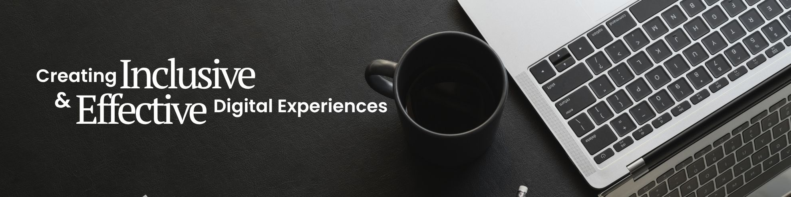

  

# Hi, I’m Daniel 👋
### Web Designer & Front-end Developer

I enjoy turning ideas into modern, user-friendly and accessible websites.

My work brings together design, front-end development and user experience. I like understanding the problem behind a project, finding a practical solution, and then refining the details that make a digital experience easier and more enjoyable to use.

This GitHub profile is where I share selected projects, experiments and code that I can openly showcase.

## What I Do

My work sits at the intersection of design, technology and user experience.

* 🎨 **Web & UI Design** – Creating clear and purposeful interfaces
* 💻 **Front-end Development** – Responsive websites built with HTML, CSS and JavaScript
* ♿ **Accessibility** – Designing with inclusive and accessible experiences in mind
* 📱 **Responsive Design** – Mobile-friendly experiences across screen sizes
* 🧩 **CMS Development** – Building and customising websites with Joomla and WordPress
* ⚡ **Digital Experiences** – Bringing design, content and technology together
* 🤖 **AI-assisted Workflows** – Exploring how AI can support design, development and creative problem-solving

## Tools & Technologies
### A selection of technologies and tools I use across design, development and digital workflows.

**Web & Front-end**
<!-- HTML · CSS · JavaScript · Bootstrap -->

**CMS & eCommerce**
<!-- Joomla · J2Commerce · OpenCart · WordPress · WooCommerce -->

**Digital Platforms**

<!-- Microsoft SharePoint · Zendesk -->

**Design, Coding & AI Tools**
<!-- Adobe Photoshop · Adobe Illustrator · Visual Studio Code · ChatGPT · Microsoft CoPilot · Google Flow -->

**Digital Practice**
<!-- SEO · GEO · Web Accessibility · GitHub · cPanel -->

## What I Enjoy Building

I enjoy building digital experiences that feel clear, purposeful and easy to use.

For me, good web design is about more than how something looks. It is about how well the design helps people understand, navigate and accomplish what they need to do.

I particularly enjoy working on projects that are:

* **Clear** – information is easy to understand and navigate
* **Inclusive** – accessibility is considered from the start
* **Responsive** – experiences work well across different devices and screen sizes
* **Thoughtful** – visual design supports usability rather than competing with it
* **Practical** – solutions are maintainable and designed to evolve

## Selected Projects

🚧 **Projects Coming Soon**

Selected projects and experiments will be added here as I build out this profile.

<!-- 
### 🌐 Project Name
Brief description of what the project does and your role.

**Built with:** Joomla · Bootstrap · JavaScript

[View Repository] · [View Website]
-->

## Currently Exploring

I am always curious about how technology can make digital work more thoughtful, inclusive and effective.

At the moment, I am exploring:

* Design systems and reusable UI components
* Modern front-end development practices
* AI-assisted design and development workflows
* New approaches to accessible digital experiences
* Ways to connect design, content and technology more effectively

## Let’s Connect

Interested in web design, front-end development, accessibility or digital experiences? Feel free to connect.

💼 [LinkedIn](https://www.linkedin.com/in/danielcktan/)
🌐 [Portfolio](https://www.danielcktan.sg)
